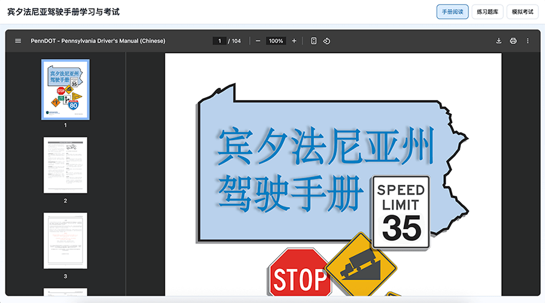
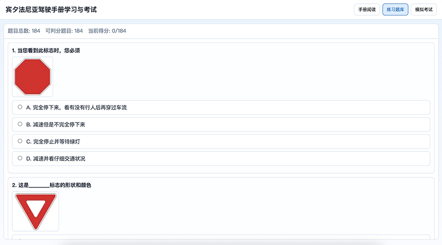
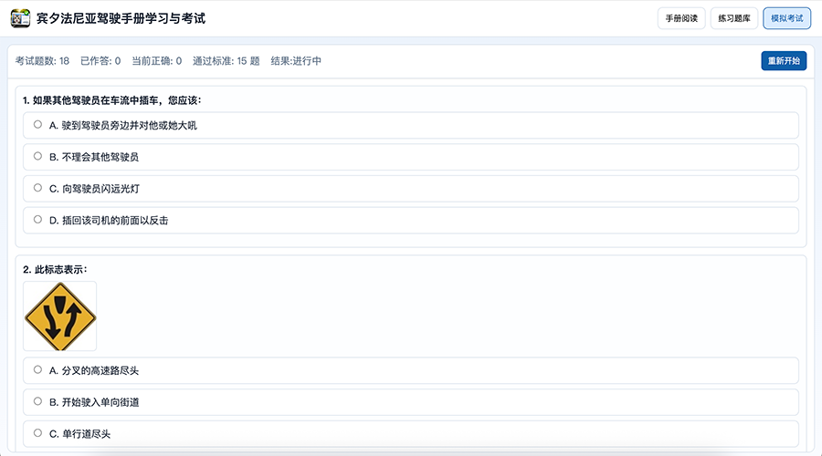

<p align="center">
  
</p>

<h1 align="center">宾夕法尼亚驾驶手册学习与考试</h1>

<br/>

在线预览版访问 [https://biallo.github.io/pa-driver-manual-app/](https://biallo.github.io/pa-driver-manual-app/)

下载桌面可执行文件访问 [https://github.com/biallo/pa-driver-manual-app/releases](https://github.com/biallo/pa-driver-manual-app/releases)
<br/>
提供 Mac/Windows/Linux 三种版本，可离线使用。

> Mac 版本可能会遇到提示“无法验证此 App 不包含恶意软件”或”无法验证开发者"的情况，<br/>
> 在“系统设置” -> “隐私与安全性”中，找到“安全性”，点击“ 仍要打开 ” 即可。

> 项目使用的《宾夕法尼亚州驾驶手册》PDF 来自 [https://www.pa.gov/agencies/dmv/driver-services/pennsylvania-drivers-manual](https://www.pa.gov/agencies/dmv/driver-services/pennsylvania-drivers-manual) <br/>
> 版本为 PUB 95 (4-21) Chinese Version

## 应用截图

<p align="center">
  
  
  
</p>

项目支持两种运行方式：

- Web 开发模式（Vite）
- 桌面可执行文件（Electron）

## 1) Web 本地运行

```bash
npm install
npm run dev
```

## 2) 桌面应用开发运行

```bash
npm install
npm run desktop:dev
```

## 3) 打包桌面可执行文件

可按系统分别打包：

```bash
npm run desktop:dist:mac
npm run desktop:dist:win
npm run desktop:dist:linux
```

产物在 `release/` 目录。
